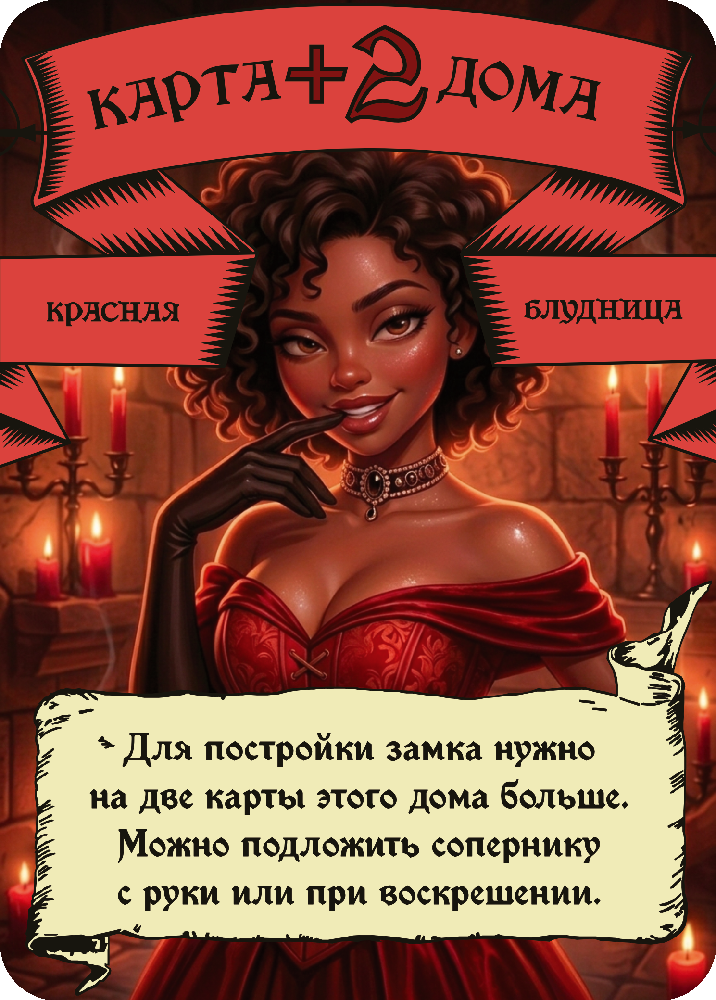
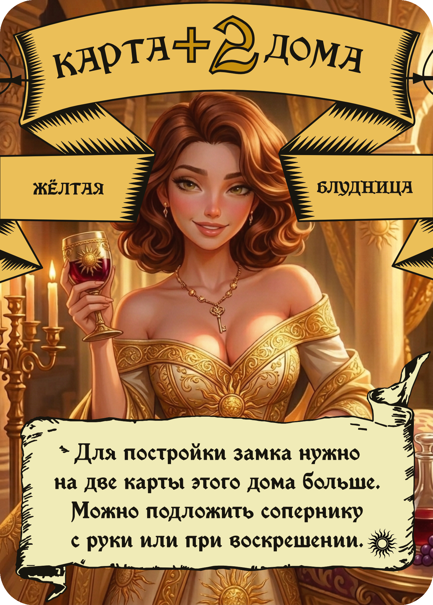
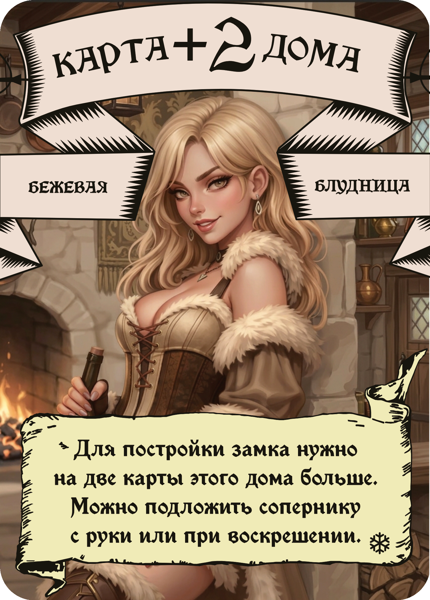

# ☀️ Чумовые замки — ремейк + дополнение «Свет с небес»
<table>
  <tr>
    <td></td>
    <td></td>
    <td></td>
  </tr>
</table>

Открытый фанатский набор исходников для настольной игры **«Чумовые замки»**: пересобранные все фоны карт, адаптированное дополнение **«Северные земли»** под стиль 3 издания, измененный баланс, а также авторское дополнение **«Свет с небес»** (Жёлтый дом).

Всё выложено в открытый доступ, чтобы любой желающий мог **допилить, поправить или распечатать себе экземпляр**.

---

## Что это

Я сделал ремейк «Чумовых замков»: пересобрал карты (попутно исправил опечатки), привёл арты и текстовки дополнения «Северные земли» к стилю 3 издания. В процессе родилась идея собственного дополнения — **Жёлтого дома Света** («небожители»): со своими ролями, приказами, смутами и парящим в облаках Замком Света. Также слегка изменил баланс.

Репозиторий содержит все рабочие материалы, а не только финальные картинки, — чтобы проект можно было продолжить, а не начинать с нуля.

---

## Что внутри

- **Исходники карт** — проекты Affinity и отсортированные сканы оригинальных карт.
- **Новые задники и арты** — обновлённая графика под стиль 3 издания.
- **Дополнение [«Свет с небес»](yellow-house.md)** — 16 карт дома, 7 приказов, 3 смуты, 1 замок (полное описание — по ссылке).
- **[Список карт](cards-list.csv)** — полная таблица всех карт со свойствами.
- **[Цветовые схемы и промты](colors-and-prompts.md)** — палитры домов, шрифты и запросы для генерации артов.

> Структуру папок смотрите в репозитории.

---

## 🚧 To-Do / Планы

- [ ] Проверка баланса Жёлтого дома на живых партиях, правки по фидбеку
- [ ] Вёрстка правил и памяток
- [ ] Перевод игры на английский
- [x] Фиксы вёрстки — часть артов съехала или растянута не во весь размер карты

Нашли баг или хотите помочь — открывайте [issue](../../issues) или pull request.

---

## Как распечатать себе экземпляр

1. Скачайте архив **Print.zip** из раздела [Releases](../../releases) — там готовые PDF для печати и исходные проекты Affinity.
2. Распакуйте и отправьте PDF в печать — в типографию или на домашнем принтере на плотной бумаге. Карты в PDF уже разложены лицо/оборот для двусторонней печати.
3. Формат карт — **63×88 мм** (стандартный).

Если хотите доработать под себя — откройте проекты Affinity из того же архива (в них последние изменения и убрано скругление под обрез), поменяйте что нужно и пересоберите. Для этого всё и выложено.

---

## Разработчикам оригинала

Этот проект сделан **с уважением и любовью к «Чумовым замкам»** — как фанатская работа, а не замена оригиналу.

Дополнение [«Свет с небес»](yellow-house.md) задумано как то, чего в игре пока нет: дом со своей механикой возвращения сгинувших. Если у вас дойдут руки — буду рад, если попробуете добавить Жёлтый дом в игру или возьмёте идеи за основу.

---

# 📋 Список изменений

## ✨ Нововведения
- Добавлен Жёлтый замок Света

## 🔧 Улучшения
- Бежевый дом: обновлены все арты под стиль 3 издания
- Свойства Слуг, Лазутчицы, Миледи бежевого дома перенесены из 3 издания
- Красная Блудница: обновлён арт (оригинал слишком тёмный)
- Смута «Инквизиция»: не удалось восстановить оригинал, заменён арт
- Приказ «Рыцарский турнир»: текстовка заменена на более понятную по аналогии с приказом «Бал»
- Синяя блудница улучшен арт (.)(.)

## ⚖️ Баланс
- «Бокленд» теперь сбрасывает карту замка (как во 2 издании, чтобы не было случайной победы)
- «Вотчина» теперь сбрасывает карту замка (причина аналогична «Бокленду»)

## 🔤 Опечатки
- Красный Казначей: исправлена опечатка в названии цвета
- В названиях Чёрного замка «Е» заменена на «Ё»
- В тексте приказа «Сбор урожая» роль «Слуга» с заглавной буквы
- В тексте приказа «Вор» роль «Лазутчица» с заглавной буквы
- В тексте приказа «Ложный приказ» добавлена запятая перед причастным оборотом
- В тексте приказа «Зелёный купец» исправлен падеж слова «дом»
- В смуте «Великий пир» слово «Смута» с заглавной буквы
- В разовом свойстве Зелёного замка исправлена опечатка в слове «сгинувших»
- В тексте приказа «Подкуп» добавлены скобки для дополнительного свойства

---

## Лицензия и права

«Чумовые замки» — игра своих авторов и правообладателей. **Это неофициальный фанатский проект.** Он не продаётся и не предназначен для коммерческого использования.

Материалы выложены для личного использования, изучения и доработки сообществом. Если вы правообладатель и у вас есть вопросы или пожелания по этому репозиторию — свяжитесь со мной, и я оперативно отреагирую.

Авторские арты и оформление дополнения «Свет с небес» можно свободно использовать в некоммерческих целях со ссылкой на этот репозиторий.
